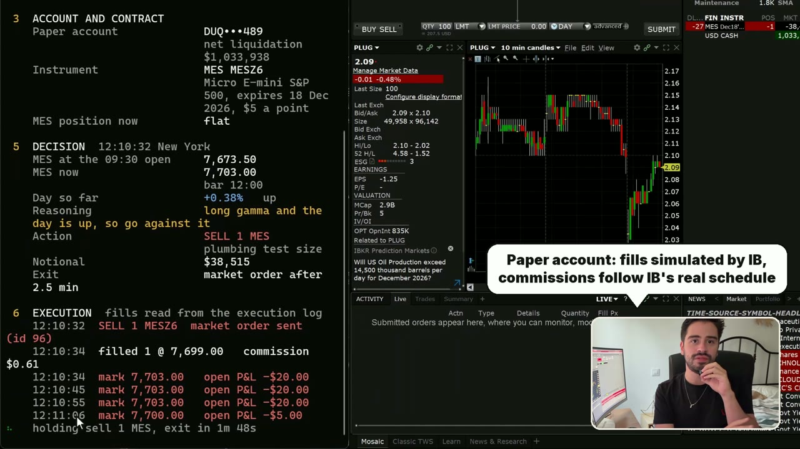
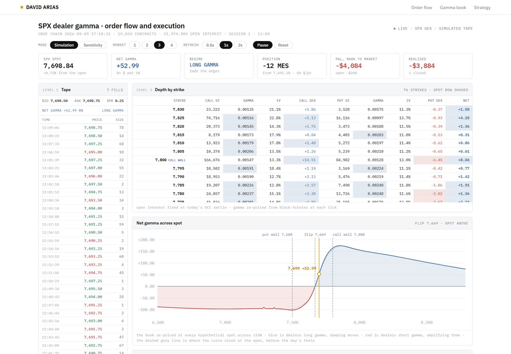

# GEX trading bot for Interactive Brokers

An automated gamma exposure (GEX) strategy in Python. Once a day it reads dealer gamma and how the S&P 500 has moved since the open, then trades Micro E-mini S&P 500 futures (MES) for the last half hour through the Interactive Brokers TWS API. Paper accounts only.

A terminal desk prints every input and the reasoning behind the trade as it happens: the regime, the rule, the account, the decision, the fills and the result.

> [!WARNING]
> **A trading idea to study, not a proven strategy.** This engine has only run on an Interactive Brokers paper account, where fills are simulated. It has never traded real money. Its only evidence is a backtest on two years of SPY data with a small edge (about 3 basis points a day, gone at 3 basis points of costs) and just 26 short gamma sessions, which is too few to trust. Live trading would face slippage, outages and regime changes the test never saw. Research and education only, not investment advice. Futures can lose more than the money in the account.

## Watch it run

[](https://www.youtube.com/watch?v=mA8H1k5O9vc)

**[Gamma Exposure (GEX) Trading Bot in Python with the IBKR API](https://www.youtube.com/watch?v=mA8H1k5O9vc)** (9 min, subtitles in English, Portuguese and Spanish). It explains GEX on a live dashboard, then runs this engine on a paper account: regime, decision, order, fill and result.

| | |
|---|---|
| Step by step GEX in Python, with formulas and charts | [davidariasfinance.com/scripts/gamma-exposure-gex](https://davidariasfinance.com/scripts/gamma-exposure-gex/) |
| Live GEX dashboard (tape, depth by strike, gamma flip, walls) | [davidariasfinance.com/gexdashboard](https://davidariasfinance.com/gexdashboard/) |

[](https://davidariasfinance.com/gexdashboard/)

## How the mechanism works

**1. Dealers hedge options, and gamma sets how much.** Market makers who trade SPX options stay delta neutral by trading the index or its futures. Delta changes as the index moves, at a rate given by gamma, so every move forces them to rebalance. Gamma exposure adds that up across the whole chain:

```
GEX = gamma x open interest x 100 x spot^2 x 1%      (calls +, puts -)
```

It reads as the dollars of S&P 500 dealers must buy or sell for each 1% move in the index.

**2. Its sign decides the direction of the hedge.**

| Dealers are | Index rises | Index falls | Effect on the market |
|---|---|---|---|
| Long gamma (GEX above zero) | their delta rises, so they sell | their delta falls, so they buy | damps moves, late moves tend to fade |
| Short gamma (GEX below zero) | their delta falls, so they buy | their delta rises, so they sell | pushes moves further, late moves tend to continue |

**3. Hedging bunches up near the close.** Dealers rebalance before the market shuts, and the bigger the move so far, the bigger the rebalance. Baltussen, Da, Lammers and Martens (2021) find the last half hour of the S&P 500 continues the day only on short gamma days, which is the flow above showing up in prices.

**4. So the bot takes the dealers' side of that flow.** At 15:30 New York it asks two questions: were dealers short or long gamma at the last close, and is the market up or down since 09:30? Short gamma means follow the day, long gamma means fade it. It holds for the last half hour and is flat before the closing auction.

### Dealer sign: why the engine does not use gamma x open interest

Inferring dealer gamma from gamma x open interest is debatable, and the weak point is the dealer sign. Open interest counts open contracts, not who holds which side. Every contract has a buyer and a seller, and the formula guesses that dealers sit opposite customers, who by convention sell calls (covered calls, collars) and buy puts (protection):

```
GEX_i = dealer_sign_i x gamma_i x OI_i x 100 x spot^2 x 1%      dealer_sign = +1 call, -1 put
```

When customers buy calls instead (speculative rallies, zero day options) or sell puts for income, dealers hold the opposite side and that contract's true sign flips. Open interest cannot show it, and it misses same day trades because it only updates overnight.

That estimate is used on the [dashboard](https://davidariasfinance.com/gexdashboard/) and the [step by step page](https://davidariasfinance.com/scripts/gamma-exposure-gex/) to explain the mechanics, because it is simple and visible strike by strike. **This engine does not trade on it.** It never computes GEX from the chain. It reads one published number a day, the SqueezeMetrics SPX net gamma at the previous close, and keeps only its sign:

```
regime_t    = sign( SqueezeMetrics GEX at the close of day t-1 )
r_t         = MES at 15:30 / MES at 09:30 - 1
position_t  = +sign(r_t) if short gamma (follow)     -sign(r_t) if long gamma (fade)
contracts   = floor( equity / (5 x MES price) )
```

To be clear, SqueezeMetrics' own [white paper](https://squeezemetrics.com/monitor/download/pdf/white_paper.pdf) starts from the same dealer assumptions, so the engine does not escape the debate. Three things change:
- **One public series, fixed before the session opens**, so there is no look ahead.
- **Only the sign**, never levels like the gamma flip or the walls, which is where a wrong sign on a few big strikes does the most damage.
- **Tested on that same series**, so whatever error the assumption carries is already inside the backtest result below instead of hidden from it.

`regime.py` still computes our own Cboe number and prints it next to the regime, as a cross-check only. On the day of the video the two disagreed in sign.

### What happens in one session

1. **Connect** to TWS or IB Gateway, refusing anything that is not a paper port. Account number is masked on screen.
2. **Pick the contract**: the nearest MES expiry with more than seven days left.
3. **Read the regime** (`regime.py`): the SqueezeMetrics net gamma of the last close before today. Its sign is the regime. A cross-check recomputes GEX from the live Cboe chain and prints it next to it, for the record only.
4. **Wait for 15:30 New York**, then read today's MES bars and the return since the 09:30 open.
5. **Decide** (`last_hour.py`): the table below, sized to notional equal to equity.
6. **Send a market order** and read the fill and commission back from the execution log.
7. **Hold**, marking the open P&L every 10 seconds.
8. **Flatten at 15:59:30** with a market order and append one line to `out/trades.csv`.

## The rule

At 15:30 New York time, compare MES with the 09:30 open.

| Dealer gamma at the previous close | Market up since the open | Market down since the open |
|---|---|---|
| Short gamma (net gamma below zero) | buy | sell |
| Long gamma (net gamma above zero) | sell | buy |

A flat day means no trade. Every position is closed at 15:59:30.

Size is notional equal to equity: net liquidation divided by 5 times the MES price ($5 a point), rounded down. On a $1m paper account that is about 26 contracts.


## Where the idea comes from

1. Baltussen, Da, Lammers and Martens, *Hedging demand and market intraday momentum*, Journal of Financial Economics, 2021 ([author PDF](https://academicweb.nd.edu/~zda/intramom.pdf)). On the S&P 500, the last half hour continues the day only when dealers are short gamma.
2. Barbon and Buraschi, *Gamma Fragility*, 2021. Positive dealer gamma goes with intraday reversal.

Regime data comes from the same series as that research: the SqueezeMetrics daily SPX net gamma, free at `https://squeezemetrics.com/monitor/static/DIX.csv`. It is downloaded at run time and not redistributed here.

## Backtest context

These tests were run while designing the rule. They are not part of this repository.

| Test, SPY last half hour, October 2023 to September 2026 | Sharpe |
|---|---|
| Rule above, 1 basis point of costs per day | 1.37 |
| Same trade always with the day, ignoring gamma | minus 2.00 |
| Same rule on QQQ | 0.88 |

**Read it with care:**
- Gross edge is about 3 basis points a day, and it disappears at 3 basis points of costs.
- Only 26 of the 723 sessions opened in short gamma.
- Worst days were long gamma fades on event days, when the book flipped during the session.

## Files

| File | What it does |
|---|---|
| `ib_engine.py` | the engine and the terminal desk: regime, decision, orders, fills, result, log |
| `last_hour.py` | the 15:30 decision, no broker involved |
| `regime.py` | today's regime from SqueezeMetrics, plus a cross-check from the Cboe chain |
| `gex.py` | full SPX chain from Cboe delayed quotes and its gamma exposure, used for the cross-check |
| `flatten_paper.py` | closes every position on the paper account so a session starts flat |
| `test_engine_offline.py` | runs a whole session against a fake broker, no TWS needed |
| `docs/` | images used in this README |

## Setup

1. **Open TWS or IB Gateway** logged into a **paper** account. Enable the API under Global Configuration, API, Settings. Paper ports are 7497 (TWS) and 4002 (Gateway).
2. **Install Python 3.11 or newer**, then `pip install -r requirements.txt`.
3. **Optional:** copy `.env.example` to `.env` to change host, port or client id.

## Run

```
python test_engine_offline.py                 # full session against a fake broker
python regime.py                              # today's regime and the Cboe cross-check
python ib_engine.py --check                   # inputs and the decision it would take, no orders
python ib_engine.py --paper --now --hold-minutes 3 --contracts 1
                                              # plumbing test while the market is open
python ib_engine.py --paper                   # real session: waits for 15:30, trades, flattens at 15:59:30
python flatten_paper.py --go                  # close everything on the paper account
```

Every session appends one line to `out/trades.csv`: regime, leg, action, contracts, entry, exit, points, net.

## Safety

- Without `--paper` it only computes and prints.
- It refuses any port that is not a paper port.
- It stands down on early close days, when the regime file is more than four days old, and after 15:55 New York.
- It refuses to trade on top of an existing MES position unless started with `--flatten-first`.
- Contract: the nearest MES expiry with more than seven days left, so it rolls a week before expiry.
- Fills and commissions are read back from the execution log. On a paper account IB simulates the fills; commissions follow IB's real schedule.

## Disclaimer

Research and education only, not investment advice. Tested on paper, never with real money. Futures carry substantial risk.

## License

MIT
